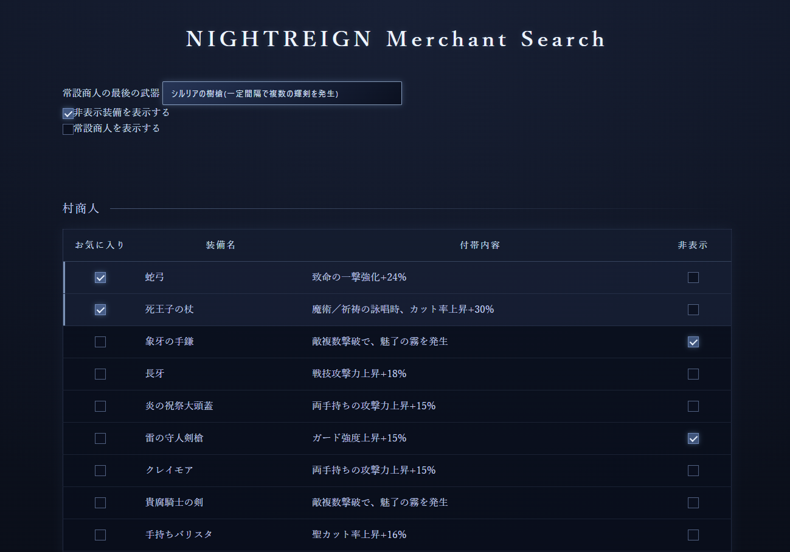

# ELDENRING NIGHTREIGN Marchant Search

エルデンリングナイトレイン商人検索ページ（非公式ファンツール）

Unofficial fan-made tool.
Japanese only.

## 概要（Overview）
ELDENRING NIGHTREIGNの商人販売テーブルを確認するための非公式ファンツールです。
複数存在する商人のテーブルから、目的の装備が販売されるかを素早く確認できるよう作成しています。

## Requirement
PCではGoogle Chromeおよび Microsoft Edge、  
スマートフォンでは AndroidのChromeにて表示確認を行っています。  
それ以外のブラウザや環境では、レイアウトが崩れる場合があります。  

## 使い方（Usage）
1. 常設商人が販売する装備の中から一番最後の装備をプルダウンリストから選択します。  
2. 表示された販売装備一覧から目的の装備を確認します。  
3. 優先度が高い装備はお気に入り登録できます。  
4. 不要な装備は非表示設定できます。  

## 主な機能（Features）
・常設商人の販売装備を確認  
・常設商人は表示と非表示が切り替えられます  
・村商人の販売装備を確認  
・大空洞商人の販売装備を確認   
・装備のお気に入り登録  
・お気に入り装備を上部へ表示  
・不要な装備の非表示設定  
・非表示装備の再表示も可能  

## 注意事項
本ページは個人制作の非公式ファンツールです。  
ゲーム内データを参考に作成していますが、情報の正確性を保証するものではありません。  
アップデート等により、実際のゲーム内仕様と異なる場合があります。  
本ページの利用によって発生した不利益・損害について、作者は責任を負いません。  

## 参考（Reference）
装備・商人テーブル情報は、以下のwikiの情報を参考に作成しています。  
エルデンリングナイトレイン攻略wiki│神攻略     
https://kamikouryaku.net/nightreign_eldenring/  

## Author

まくら（https://x.com/MakuraPiro）

## 免責（Disclaimer)

©Bandai Namco Entertainment Inc. / ©FromSoftware, Inc.  

本ページはファン制作のものであり公式サービスではありません。  
使用されているゲーム内データの著作権は、  
株式会社バンダイナムコエンターテイメントおよび株式会社フロム・ソフトウェアに帰属します。  

### 更新情報
Version 1.0（公開日：2026年7月8日）  
・商人販売テーブル検索機能を公開  
・お気に入り、非表示機能  
・最終更新日：2026年7月7日  

